# Laboratory Work 3: Concurrent Memory Scramble Implementation

**Student:** Ilico Artemie
**Group:** FAF-231
**Date:** November 2025

This report details the development and analysis of a networked, multi-player implementation of the classic Memory Scramble game. The core challenge addressed is the design of a **concurrent, turn-less gameplay model** where multiple players can attempt to flip cards simultaneously. The solution is built upon a robust, thread-safe `Board` Abstract Data Type (ADT) implemented in TypeScript, which manages state transitions, player control, and concurrency using asynchronous programming patterns. The project structure, containerization strategy with Docker, server-side command handling, and rigorous testing procedures are documented.

## Project Architecture and Directory Structure

The project is organized to separate configuration, source code, and deployment assets.

*   **`boards/`**: Contains configuration files (e.g., `perfect.txt`, `ab.txt`) that define the initial layout and content of the game board.
*   **`src/`**: Houses the core TypeScript source files:
    *   `board.ts`: The central **Mutable ADT** for the game state, managing card positions, face-up status, and player control.
    *   `player.ts`: Defines the `Player` ADT, tracking individual player state, including controlled cards (`firstCard`, `secondCard`).
    *   `server.ts`: The HTTP server implementation using Express.js, exposing RESTful endpoints for game commands.
    *   `commands.ts`: Contains the high-level game logic functions (`look`, `flip`, `map`, `watch`) that interact with the `Board` ADT.
    *   `simulation.ts`: Provides a concurrent simulation environment for stress-testing the board's thread-safety and concurrency mechanisms.
*   **`test/`**: Includes unit tests, notably `board.test.ts`, to verify the correctness of the `Board` ADT's logic and rule enforcement.
*   **`public/`**: Stores static web assets served to clients.
*   **`doc/`**: Generated documentation using TypeDoc.

The entire application is designed for containerized deployment, defined by the `Dockerfile` and orchestrated by `docker-compose.yml`.

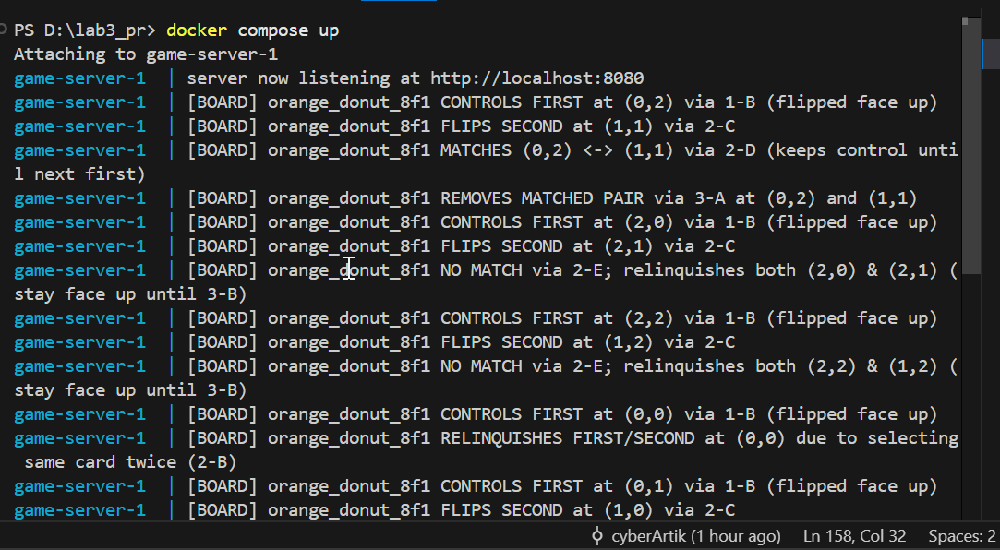

## Containerization Strategy

### Dockerfile: Environment Definition

The `Dockerfile` establishes a consistent execution environment based on a Node.js image. The key steps involve dependency management and compilation:

1.  **Base Image:** `FROM node:22.12`
2.  **Dependency Installation:** `npm install` ensures all project dependencies are available.
3.  **Compilation:** `RUN npm run compile` transpiles the TypeScript source code into JavaScript, ready for execution.
4.  **Exposure:** `EXPOSE 8080` declares the service port.
5.  **Entrypoint:** The `CMD` instruction executes the compiled server, passing the port and the default board configuration (`boards/perfect.txt`).

```dockerfile
FROM node:22.12
WORKDIR /app
COPY package*.json ./

RUN npm install
COPY . .
RUN npm run compile
EXPOSE 8080
CMD ["node", "--require", "source-map-support/register", "dist/src/server.js", "8080", "boards/perfect.txt"]
```

### Docker Compose: Service Orchestration

The `docker-compose.yml` file simplifies the deployment process, defining a single service, `game-server`. It instructs Docker to build the image from the current directory (`build: .`) and maps the container's internal port 8080 to the host machine's port 8080, making the service accessible externally.

```dockerfile
services:
  game-server:
    build: .
    ports:
      - "8080:8080"
    command: ["node", "--require", "source-map-support/register", "dist/src/server.js", "8080", "boards/perfect.txt"]
```

## Game Logic Implementation: Key Methods

The core of the concurrent game logic resides in the `Board` ADT (`board.ts`) and the command handlers (`commands.ts`).

### 1. Concurrency Management (`board.ts`)

The `Board` class utilizes a **Deferred Promise** pattern to manage concurrent access to cards.

*   **`waitingForControl` Map:** This map stores an array of `Deferred<void>` promises for each card location. When a player attempts to flip a card already controlled by another player (Rule 1-D), their operation is blocked by awaiting a promise from this array.
*   **`flipUp(playerId, row, col)` Method:** This is the critical method for state mutation. It encapsulates the complex logic for:
    *   **Rule 1-D Handling:** If the card is controlled, it adds the player's request to `waitingForControl` and awaits resolution.
    *   **State Transition:** Updates the `faceUp` and `controller` arrays.
    *   **Match/Mismatch Resolution (Rules 3-A/3-B):** When a player attempts a *first card* flip, this method first triggers the cleanup of any previously controlled cards (match removal or turning face-down).
*   **`notifyChange()` Method:** Called after any successful state mutation (e.g., a card flip or a map operation). It resolves all promises stored in the `changeResolvers` map, notifying all watching clients of the board update.

### 2. Server-Side Command Handling (`server.ts` and `commands.ts`)

The `server.ts` module sets up Express routes that map HTTP requests to the core game logic functions in `commands.ts`.

| Endpoint | Command Function | Description | Technical Focus |
| :--- | :--- | :--- | :--- |
| `/look/:playerId` | `look(board, playerId)` | Retrieves the current board state as seen by the specified player. | **`board.render(playerId)`**: Generates a player-specific textual representation of the board, masking face-down cards. |
| `/flip/:playerId/:location` | `flip(board, playerId, r, c)` | Attempts to flip a card at a given location. This is the primary interaction point for players. | **`board.flipUp(playerId, r, c)`**: Executes the full, concurrent game logic, including waiting for control and match resolution. |
| `/replace/:playerId/:fromCard/:toCard` | `map(board, playerId, f)` | Applies a transformation function to all cards on the board. Used for administrative or special game actions. | **`board.map(f)`**: Iterates over the `cards` array and applies the asynchronous transformation function `f` to each non-null card. |
| `/watch/:playerId` | `watch(board, playerId)` | Blocks the connection until a board state change occurs, enabling real-time updates for clients. | **`board.addChangeWatcher(playerId, resolve)`**: Utilizes the `changeResolvers` map and promises to implement a long-polling mechanism. |

## Development and Verification

### Documentation Generation

Project documentation was generated using **TypeDoc** from the JSDoc comments embedded in the TypeScript source files. This process ensures that the documentation is always synchronized with the code's structure, providing a clear overview of classes, methods, parameters, and return types. The command `npm run doc` automates this process.

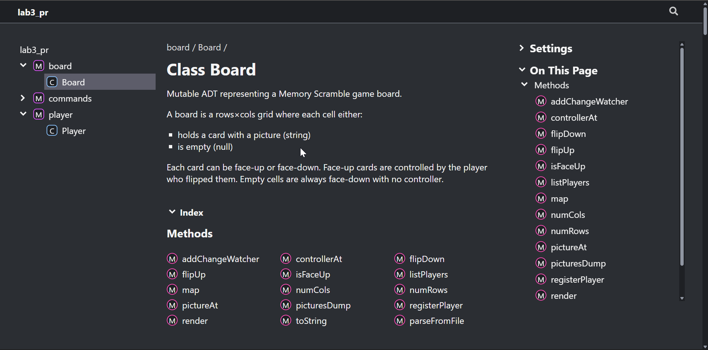
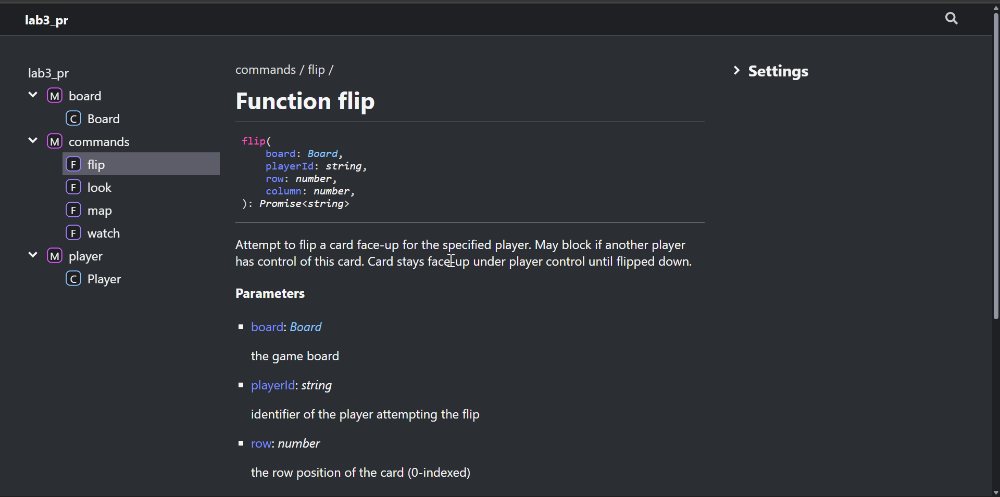
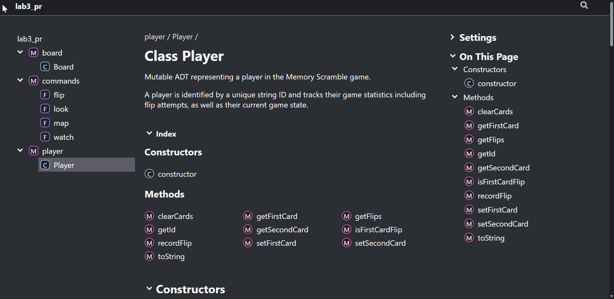

### Unit Testing

The correctness of the `Board` ADT's state management and rule enforcement is verified through unit tests in `board.test.ts`. The tests cover various scenarios, including card parsing, state transitions, control acquisition, and match resolution, ensuring the core game logic is robust against unexpected inputs and concurrent operations. The test suite is executed via `npm run test`.

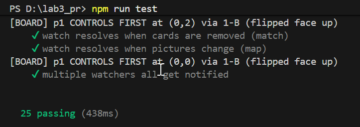

## Concurrency Simulation

To validate the thread-safety and concurrent behavior of the `Board` ADT, a dedicated simulation (`simulation.ts`) was developed.

### Polling Simulation

The basic simulation runs multiple automated players concurrently, each attempting a sequence of first and second card flips. A dedicated **Watcher** client is registered to monitor the board state using the `addChangeWatcher` mechanism. This demonstrates the system's ability to handle high-frequency, interleaved state mutations from multiple sources.

```
npm run simulation
```

The logs track every player action and every board observation by the watcher, confirming that all state changes are correctly propagated and that the concurrency control mechanisms prevent race conditions.

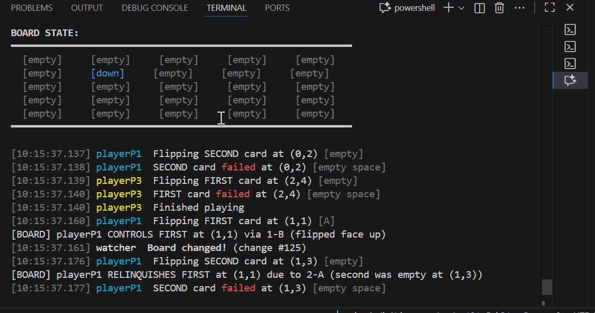
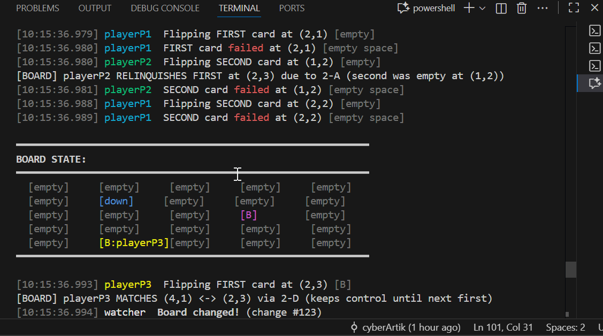

### Watcher-Only Simulation

A second simulation mode focuses on the efficiency of the `watch` command. In this scenario, multiple players are registered as watchers, and a separate set of players performs moves. This verifies that the **long-polling** mechanism implemented via `changeResolvers` correctly notifies all waiting clients immediately upon a state change, demonstrating an efficient, event-driven update model.

```
npm run simulation watch
```

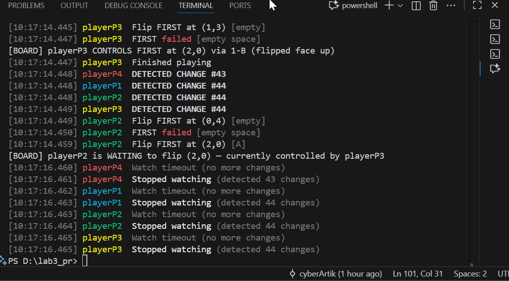

## Detailed Rule Implementation Analysis

The core game rules are implemented within the `flipUp` method of the `Board` ADT, ensuring atomic and consistent state changes.

### First Card Flip Logic

| Rule | Description | Implementation Detail |
| :--- | :--- | :--- |
| **1-A: Empty Space** | Attempting to flip an empty space fails. | The method checks if `cards[r][c]` is `null` and throws an error, preventing state change. |
| **1-B: Face Down** | Card is flipped face-up, and the player gains control. | `faceUp[r][c]` is set to `true`, and `controller[r][c]` is set to `playerId`. |
| **1-C: Face Up, Uncontrolled** | Card remains face-up, and the player gains control. | `controller[r][c]` is set to `playerId`. The player's previous lingering cards (Rule 3-B) are turned face-down before this action. |
| **1-D: Face Up, Controlled** | Operation waits until the card is free. | The player's promise is added to `waitingForControl[r,c]`, and the method `await`s its resolution, implementing the concurrency lock. |

The following images illustrate the state transitions:

## Play by rules

First card: a player tries to turn over a first card by identifying a space on the board…

### 1-A: If there is no card there (the player identified an empty space, perhaps because the card was just removed by another player), the operation fails.
If I try to click on a card that was removed after a match, i will get a error pop up and i won't be able to take control of that space.

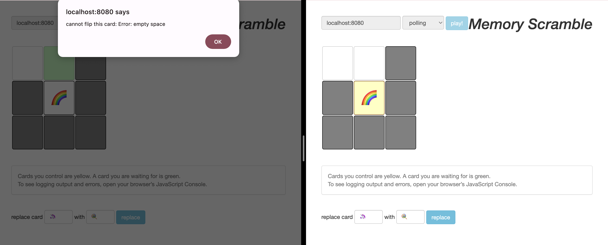

### 1-B: If the card is face down, it turns face up (all players can now see it) and the player controls that card.
I flipped a card and it can be seen both on my screen and the other player's screen.


### 1-C: If the card is already face up, but not controlled by another player, then it remains face up, and the player controls the card.
No one had control over the rainbow card and it was face up, so I clicked on it and took control.


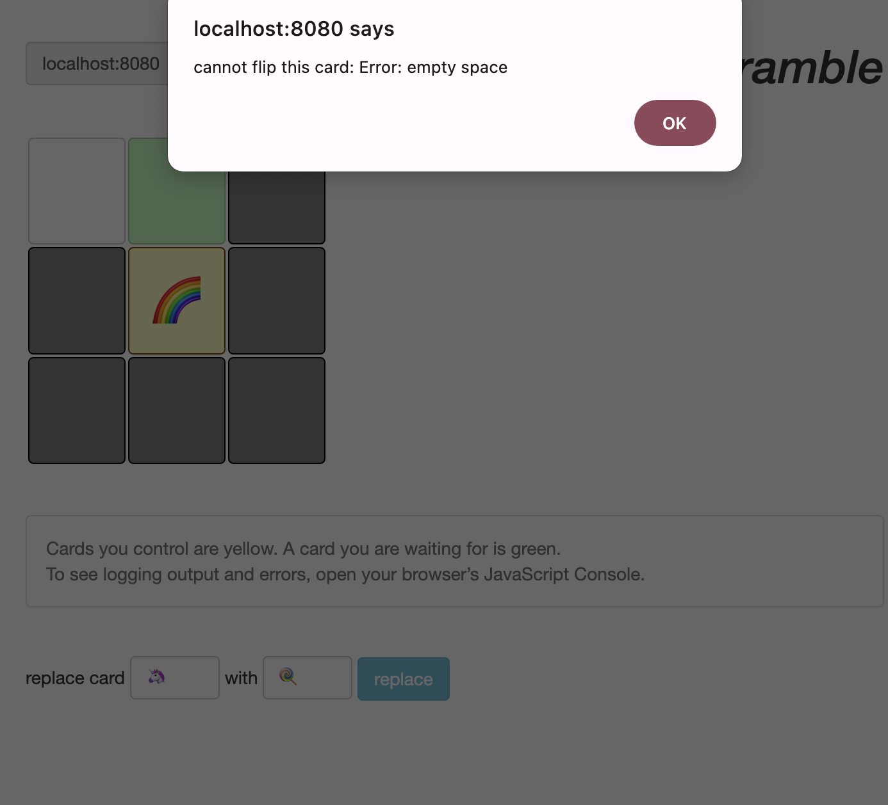

### 1-D: And if the card is face up and controlled by another player, the operation waits. The player will contend with other players to take control of the card at the next opportunity.
If I click on a card controlled by someone else, it will turn green and I will wait till it is free.

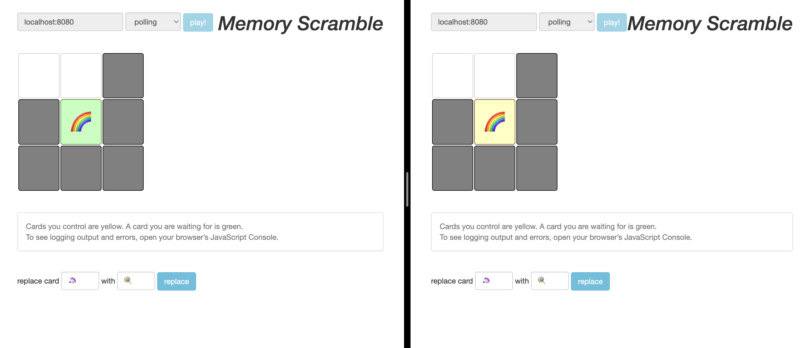

Second card: once a player controls their first card, they can try to turn over a second card…

### 2-A: If there is no card there, the operation fails. The player also relinquishes control of their first card (but it remains face up for now).
I tried to take control of empty space as second card and I relinquished control of the first card.


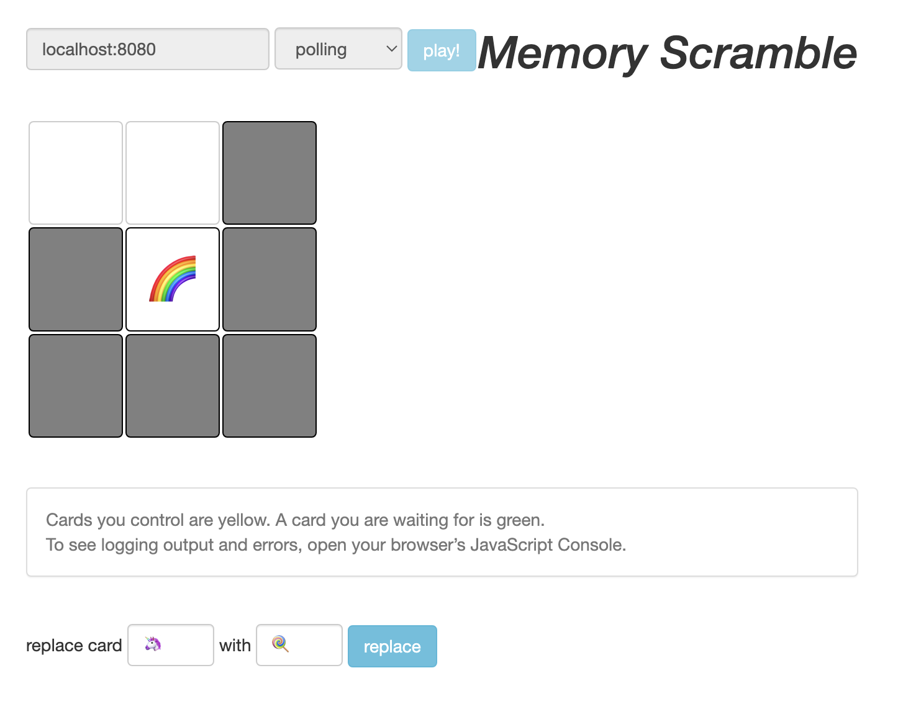

### 2-B: If the card is face up and controlled by a player (another player or themselves), the operation fails. To avoid deadlocks, the operation does not wait. The player also relinquishes control of their first card (but it remains face up for now).
 When I try to choose as second card a already controlled card, I lose control of first card and I get an error.

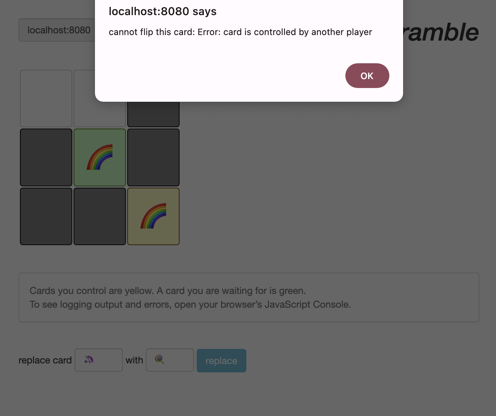

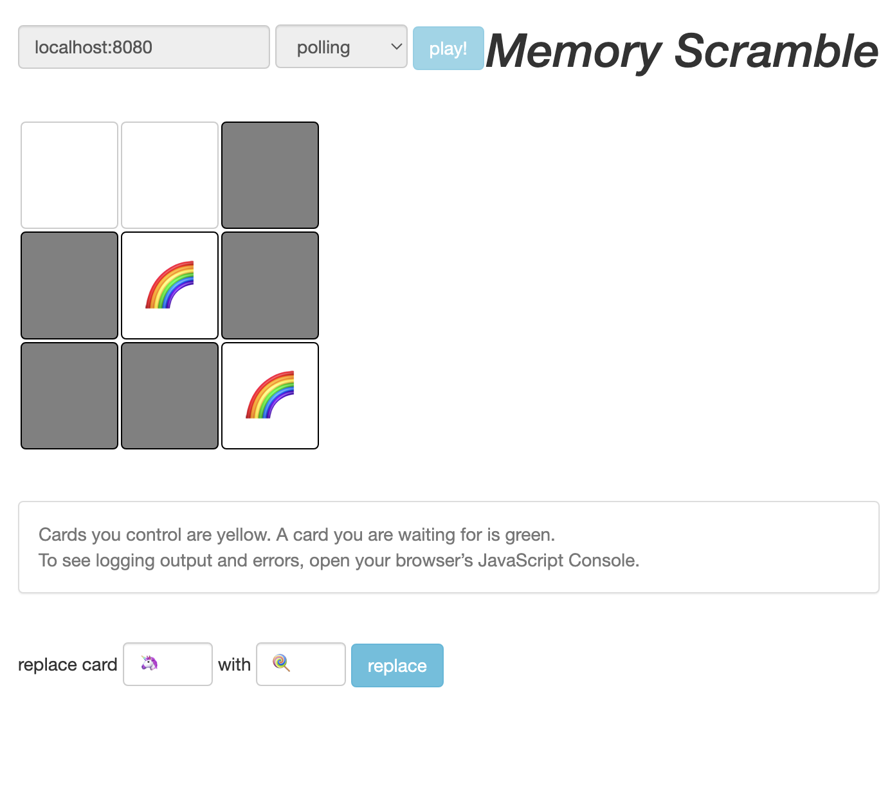

If the card is face down, or if the card is face up but not controlled by a player, then:

### 2-C: If it is face down, it turns face up.

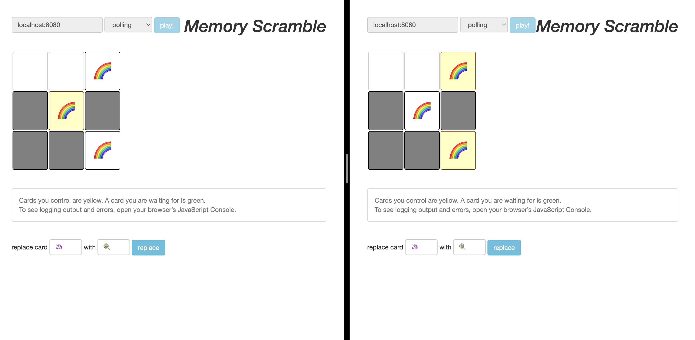

### 2-D: If the two cards are the same, that’s a successful match! The player keeps control of both cards (and they remain face up on the board for now).


### 2-E: If they are not the same, the player relinquishes control of both cards (again, they remain face up for now).

I tried to flip a rainbow and then I flipped an unicorn. They are not a match, so I lost control over them.

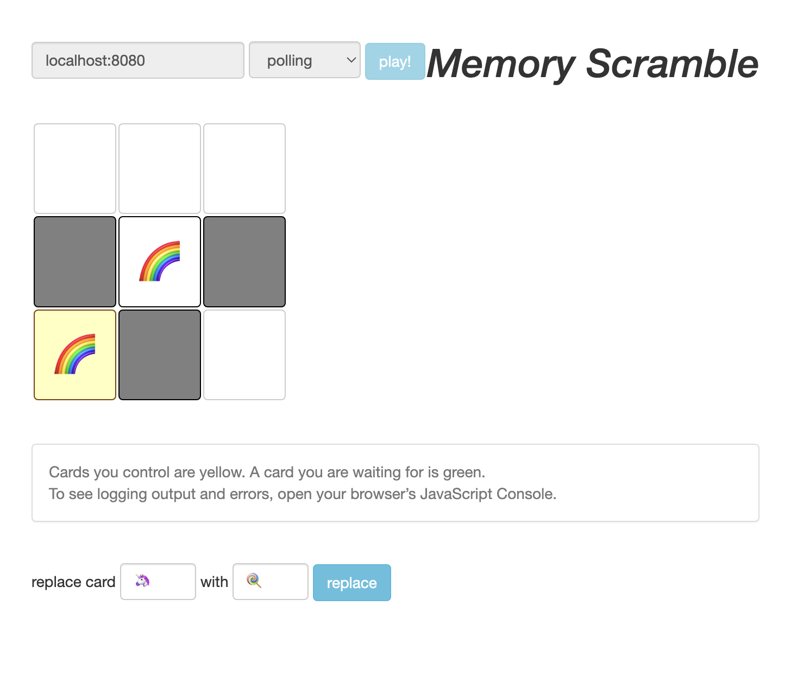


After trying to turn over a second card, successfully or not, the player will try again to turn over a first card. When they do that, before following the rules above, they finish their previous play:

### 3-A: If they had turned over a matching pair, they control both cards. Now, those cards are removed from the board, and they relinquish control of them. Score-keeping is not specified as part of the game.

The removed cards are from matching pairs:

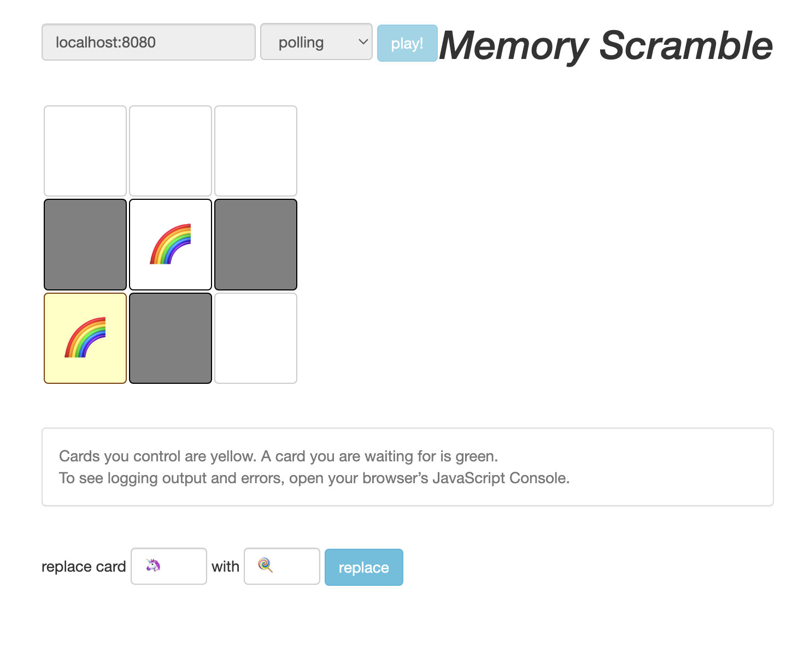

### 3-B: Otherwise, they had turned over one or two non-matching cards, and relinquished control but left them face up on the board. Now, for each of those card(s), if the card is still on the board, currently face up, and currently not controlled by another player, the card is turned face down.

 After losing relinquishing control of pair, they are turned down when I make next move.


### Map
I mapped the unicorns to lolipops succesfully:

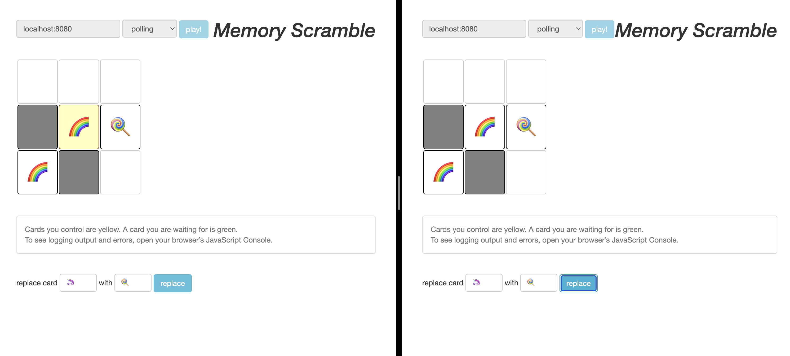

## Conclusion

The implementation successfully delivers a concurrent, networked Memory Scramble game. The use of a thread-safe `Board` ADT with asynchronous control mechanisms (`Deferred` promises and `waitingForControl`) effectively manages simultaneous player interactions, preventing race conditions and ensuring rule consistency. The modular design, coupled with containerization and comprehensive testing, provides a robust and verifiable solution to the challenge of concurrent state management in a multi-player environment.
